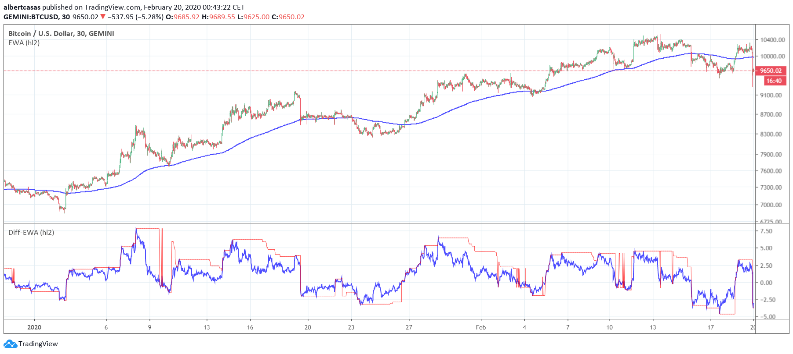

# EWA in Pine Script
Implementation of Exponentially Weighted Averages and it difference in Pine Script. It can generate a line that adjust to the overall trend of a graphic.

## Exponentially Weighted Averages
This technique is used for generating smoother lines that adjust to a graphic. In finances, it is used to predict the overall trend of a graphic. The function that defines the EWA is the one bellow:

&nbsp;&nbsp;&nbsp;&nbsp;&nbsp;&nbsp;Vt = β V(t-1) + (1 - β) θt

Where:
* β: Hyperparammeter that we have to adjust.
* V(t-1): Value calculated for the previous element of the graphic.
* θt: Current element of the graphic.

## Example
This example has been generated over the graphic BTC/USD with candles of 30 min using the following values:
 - beta = 0.01
 - length = 1
 
 
 
 ## License
 
 This repository is licensed under the GNU General Public License v3.0. See attached [LICENSE](LICENSE) file for more details.
